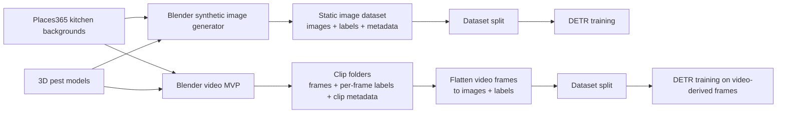
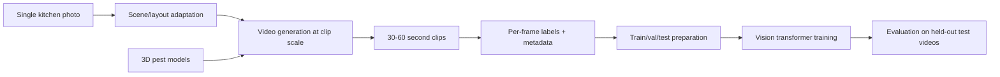

# Synthetic-Data-Generation-for-Pest-Detection


STA 561 Final Project

## Current Verified State

- This repository currently represents a **Phase 1 baseline**, not the full final assignment pipeline.
- Windows environment setup has been tested on this repository.
- A Conda environment named `pest-synth` is working with:
  - Python 3.10
  - PyTorch 2.6.0 + CUDA
  - `transformers`, `timm`, and `Pillow`
- Blender-based generation has been verified on Windows.
- A smoke synthetic dataset has been generated locally:
  - `data/generated/image_smoke_v1/`
  - `data/splits/image_smoke_v1/split.json`
- A video-generation MVP has been implemented locally:
  - `scripts/generate_synthetic_video_blender.py`
  - `data/generated/video_clip_smoke_v1/`
  - `scripts/flatten_video_frames_for_detection.py`
  - `data/generated/video_frame_smoke_v1/`
- Video-derived frame training has also been validated locally:
  - `data/splits/video_frame_smoke_v1/split.json`
  - `outputs/detr_video_frame_smoke_v1/`

## Phase Scope

What this repository currently does:

- generates labeled synthetic pest images
- generates short video-style frame sequences with per-frame labels
- flattens generated video frames back into the current detection training format
- trains a DETR-based detector on those images
- trains a DETR-based detector on flattened video-derived frames
- provides a working local baseline for data generation and training

What it does **not** yet fully do:

- generate full 30-60 second labeled videos at assignment scale
- adapt scene layout from a single user-provided kitchen image
- demonstrate final TPR/FPR target compliance on instructor test videos

For a formal requirement-by-requirement comparison, see:

- `REQUIREMENTS_GAP_ANALYSIS.md`
- `VIDEO_GENERATION_PLAN.md`

## Progress Summary

Current progress is:

- image generation pipeline working
- image-label dataset split working
- DETR smoke training working on static synthetic images
- video-generation MVP working for short clips
- frame flattening working for video-to-detection reuse
- DETR smoke training working on flattened video-derived frames

In short:

- the core rendering, labeling, flattening, and training loop now works end to end
- the biggest remaining gap is scaling the video pipeline to longer clips, more clips, and final evaluation

## Current Outputs

Key currently generated artifacts:

- Static image smoke dataset:
  - `data/generated/image_smoke_v1/`
- Static image split:
  - `data/splits/image_smoke_v1/split.json`
- Static image DETR smoke training output:
  - `outputs/detr_image_smoke_v1/`
- Video smoke clip dataset:
  - `data/generated/video_clip_smoke_v1/`
- Flattened video-frame dataset:
  - `data/generated/video_frame_smoke_v1/`
- Flattened video-frame split:
  - `data/splits/video_frame_smoke_v1/split.json`
- Video-frame DETR smoke training output:
  - `outputs/detr_video_frame_smoke_v1/`

## Technical Flow

### Current Implemented Pipeline



### Target Assignment Pipeline



## Windows Notes

- `python ...` commands in this README work on Windows if you run them inside the `pest-synth` Conda environment.
- `bash ...` commands do **not** work in plain PowerShell unless you have Git Bash, WSL, or another Bash shell installed.
- On Windows, prefer:
  - `conda run -n pest-synth python ...`
  - calling Blender with its installed executable path, for example:
    - `"$env:ProgramFiles\Blender Foundation\Blender 5.1\blender.exe"`
- For `Places365` background extraction on Windows, use `--mode copy` instead of `--mode symlink`.

## Documentation Map

- Project status + runbook: `PROJECT_STATUS.md`
- Execution plan: `PROJECT_EXECUTION_PLAN.md`
- Data sources: `data_sources/SYNTHETIC_DATA_SOURCES.md`
- Requirement gap analysis: `REQUIREMENTS_GAP_ANALYSIS.md`
- Video generation plan: `VIDEO_GENERATION_PLAN.md`
- Windows rerun notes: `WINDOWS_RUN_TROUBLESHOOTING.md`
- Submission notes: `submissions/README.md`
- Model manifest: `assets/models/MODEL_MANIFEST.md`

## Start Here

Recommended reading order:

1. `PROJECT_STATUS.md`
2. `REQUIREMENTS_GAP_ANALYSIS.md`
3. `VIDEO_GENERATION_PLAN.md`
4. `WINDOWS_RUN_TROUBLESHOOTING.md` if you are running locally on Windows

## Team Workflow

What is tracked in git:

- source code
- environment/config files
- documentation
- lightweight manifests and catalogs that describe external assets

What is intentionally **not** tracked in git:

- downloaded raw datasets
- generated image/video datasets
- generated split files
- checkpoints and training outputs
- downloaded 3D model binaries

That means teammates should expect to recreate local data artifacts after `git pull`.

## New Collaborator Quick Start

If a teammate pulls this repository onto a fresh machine, use this order:

1. Read `PROJECT_STATUS.md` for the current phase and known limitations.
2. Create the environment from `environment.yml`.
3. Install Blender.
4. Review `WINDOWS_RUN_TROUBLESHOOTING.md` if running on Windows.
5. Download the three required pest model files into:
   - `assets/models/rat/rat_primary.glb`
   - `assets/models/mouse/mouse_primary.glb`
   - `assets/models/cockroach/cockroach_primary.glb`
6. Download Places365 backgrounds and build `data/raw/kitchen_backgrounds/`.
7. Generate a smoke dataset locally before attempting larger runs.
8. Split the dataset and run smoke training.

Recommended local build order:

```text
environment -> blender -> models -> backgrounds -> generation -> split -> training
```

## Repository Contract

Use the repository like this:

- code and docs are shared through git
- datasets and checkpoints are local working artifacts
- if a path lives under `data/generated/`, `data/splits/`, or `outputs/`, assume it should be reproducible rather than committed

If you create a new generated dataset or checkpoint:

- document how to regenerate it
- do not rely on it being present after a teammate pulls the repo

## 1. Project Overview

In this project we build an automated pipeline that generates **synthetic pest detection datasets** from kitchen images and trains a **DETR-based vision transformer detector** to detect pests.

The system will:

1. Take a **single kitchen image** as input
2. Automatically generate **synthetic videos (30–60 seconds)** containing pests
3. Label each frame with:
   - pest type
   - bounding boxes
4. Train a **vision transformer detector (DETR)** to localize and classify pests
5. Evaluate the detector on **held-out test videos**

The goal is to investigate whether **synthetic data can effectively train pest detection models**.

---

# 2. Project Requirements (From Assignment)

The project must satisfy the following requirements:

### Input
- A still image of a **commercial kitchen**

### Synthetic Data Generation
The system must automatically generate videos with:

- pests (mice, rats, cockroaches)
- realistic movement
- randomized environment conditions

Video requirements:

- length: **30–60 seconds**
- frame-level annotations
- bounding boxes for pests
- labeled pest type

Generation must be:

- **fully automated**
- controlled via **Python**
- scalable to **thousands of videos on Duke compute cluster**

---

### Detection Model

Train a **vision transformer model (DETR)** to detect pests from generated videos.

The model must:

- identify pest type
- predict bounding boxes
- generalize to **unseen test videos**

Model choice for this repository:

- **DETR (Detection Transformer)** with a transformer-based detection head.
- The project objective is to train a vision transformer that identifies both pest location and pest type.

---

### Performance Target (For A+)

On instructor-provided test videos:

- **True detection rate ≥ 80%**
- **False positive rate < 5%**

---

# 3. Key Research Questions

Our project explores several research questions:

1. Can synthetic data effectively train pest detection models?
2. Which synthetic randomization strategies improve detection?
3. Does video-based generation outperform static image synthesis?
4. What factors reduce false positives in cluttered kitchen environments?

---

# 4. System Architecture

The system will consist of the following components:

---

## Quick Start: Synthetic Image Pipeline

### Environment Setup

Create the environment:

```bash
conda env create -f environment.yml
conda activate pest-synth
```

Windows users can also run project commands without activating first:

```powershell
conda run -n pest-synth python --version
```

### Step 1) Collect kitchen-only backgrounds from Places365

Download Places365 (small version) automatically:

```bash
python scripts/download_places365.py \
  --root data/raw/places365 \
  --split val \
  --small true
```

Then collect kitchen-only images:

```bash
python scripts/collect_places365_kitchen.py \
  --places-root data/raw/places365 \
  --out-dir data/raw/kitchen_backgrounds \
  --mode copy \
  --max-per-class 500
```

This creates:

- `data/raw/kitchen_backgrounds/<kitchen-class>/*.jpg`
- `data/raw/kitchen_backgrounds/manifest.csv`

### Step 2) Download 3D models from Sketchfab

Model candidates are listed in:

- `assets/models/sketchfab_model_catalog.csv`

Download one `rat`, one `mouse`, and one `cockroach` model file into `assets/models/`, for example:

- `assets/models/rat/rat_primary.glb`
- `assets/models/mouse/mouse_primary.glb`
- `assets/models/cockroach/cockroach_primary.glb`

### Step 3) Generate synthetic images with Blender

On DCC, this is a heavy stage; prefer submitting via `job.sbatch` (`STAGE=generate`) instead of running on a login node.

macOS / Linux style:

```bash
bash scripts/run_generate_synthetic.sh \
  blender \
  data/raw/kitchen_backgrounds \
  assets/models/rat/rat_primary.glb \
  assets/models/mouse/mouse_primary.glb \
  assets/models/cockroach/cockroach_primary.glb \
  data/generated/synth_v1 \
  200
```

Windows PowerShell example:

```powershell
$blender = Join-Path $env:ProgramFiles "Blender Foundation\Blender 5.1\blender.exe"
& $blender --background --python scripts\generate_synthetic_blender.py -- --background-dir data\raw\kitchen_backgrounds --rat-model assets\models\rat\rat_primary.glb --mouse-model assets\models\mouse\mouse_primary.glb --cockroach-model assets\models\cockroach\cockroach_primary.glb --out-dir data\generated\image_smoke_v1 --num-images 60
```

Outputs:

- Images: `data/generated/synth_v1/images/*.png`
- Normalized bbox labels (`class x_center y_center width height`): `data/generated/synth_v1/labels/*.txt`
- Metadata: `data/generated/synth_v1/metadata.csv`

## DCC Run Policy (Login Node vs Compute Node)

- Canonical script entrypoints remain under `scripts/`.
- Root-level wrappers:
  - `run.sh`: safe wrapper for lightweight/local usage.
  - `job.sbatch`: Slurm batch entrypoint for real DCC runs.
- For large outputs/checkpoints/generated data, prefer paths under `/work/$USER`.

### Lightweight (safe on login node)

Split only:

```bash
bash run.sh split \
  --data-dir /work/$USER/pest_synth/data/generated/synth_v1 \
  --out-dir /work/$USER/pest_synth/data/splits/synth_v1 \
  --train-ratio 0.7 --val-ratio 0.15 --test-ratio 0.15 \
  --seed 42
```

### Real execution on DCC (recommended)

Train with defaults in `job.sbatch`:

```bash
sbatch job.sbatch
```

If your allocation requires explicit account/partition:

```bash
sbatch -A <ACCOUNT> -p <PARTITION> job.sbatch
```

Eval stage:

```bash
sbatch --export=ALL,STAGE=eval,WORK_ROOT=/work/$USER/pest_synth job.sbatch
```

Generate stage:

```bash
sbatch --export=ALL,STAGE=generate,WORK_ROOT=/work/$USER/pest_synth,NUM_IMAGES=500 job.sbatch
```

### Data source references

- `data_sources/SYNTHETIC_DATA_SOURCES.md`

---

## DETR Baseline (Train + Eval)

This pipeline trains and evaluates **DETR only**.
For DCC, run heavy stages on compute nodes (`sbatch`/`srun`), not login nodes.

### 1) Split synthetic dataset

```bash
python scripts/split_detection_dataset.py \
  --data-dir data/generated/image_smoke_v1 \
  --out-dir data/splits/image_smoke_v1 \
  --train-ratio 0.7 --val-ratio 0.15 --test-ratio 0.15 \
  --seed 42
```

### 2) Train DETR

```bash
python scripts/train_detr.py \
  --data-dir data/generated/image_smoke_v1 \
  --split-json data/splits/image_smoke_v1/split.json \
  --output-dir outputs/detr_image_smoke_v1 \
  --epochs 5 \
  --batch-size 4 \
  --lr 1e-4
```

### 3) Evaluate DETR (TPR / FPR-style report)

```bash
python scripts/eval_detr.py \
  --data-dir data/generated/image_smoke_v1 \
  --split-json data/splits/image_smoke_v1/split.json \
  --checkpoint-dir outputs/detr_image_smoke_v1/best \
  --output-json outputs/detr_image_smoke_v1/eval_test.json \
  --confidence-threshold 0.5 \
  --iou-threshold 0.5
```
